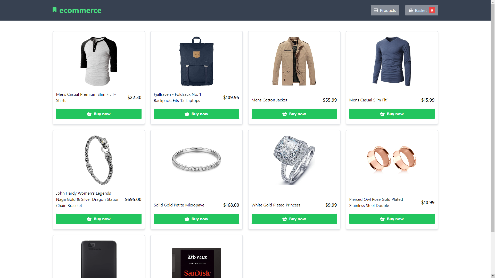
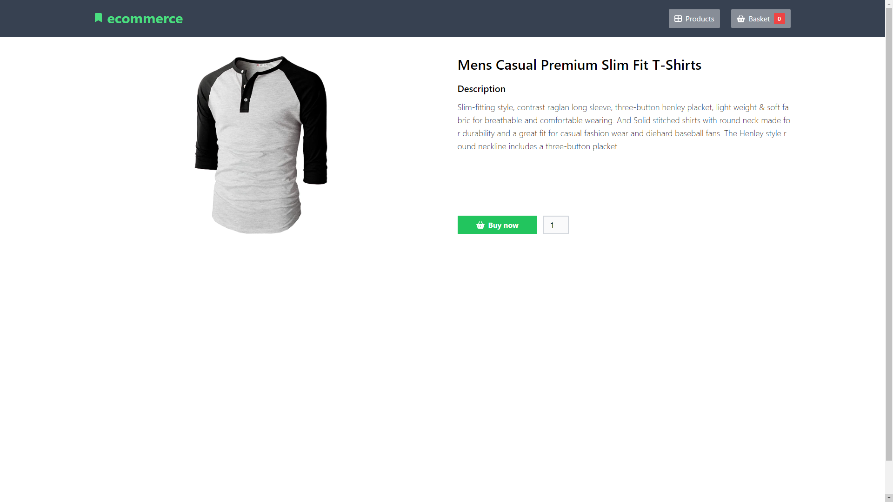
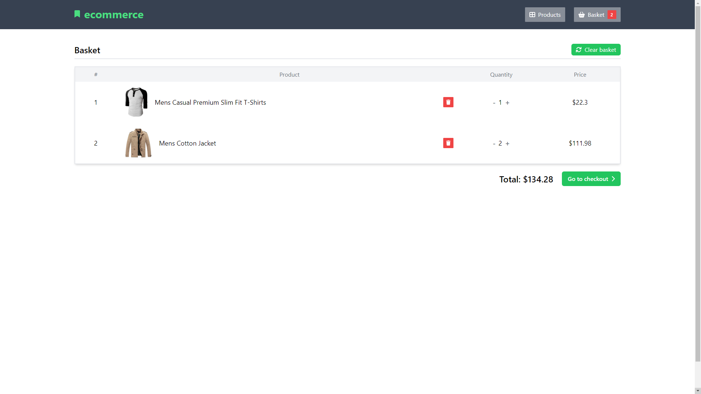
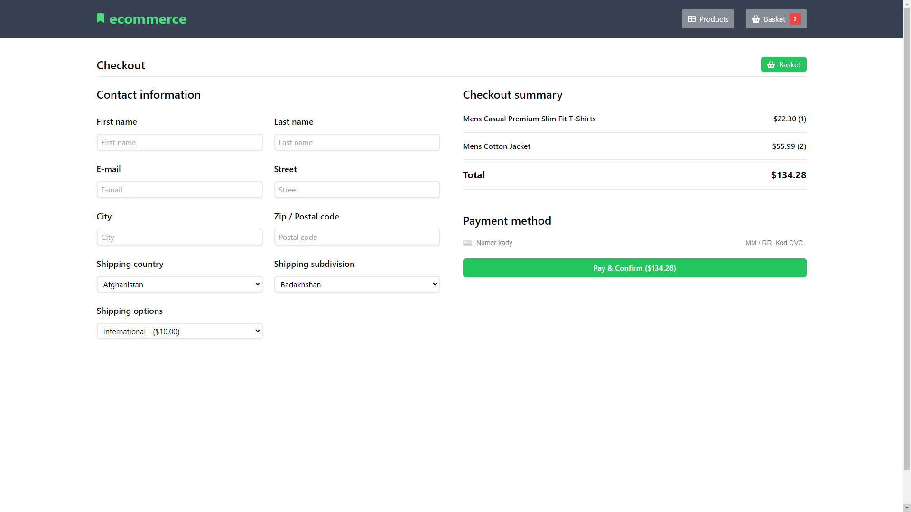

# E-commerce Online Shop
Online e-commerce shop which allow users to buy different products. Application uses CommerceJS API to store all products data. User can pay for the products with credit card provided by Stripe payments.

# Live Preview
You can visit website here: https://ecommerce-online-shop-018767.netlify.app

# Tech Stack
+ React
+ Typescript
+ TailwindCSS
+ Redux Toolkit
+ CommerceJS API

# Screenshots preview 

 

 

 
  
